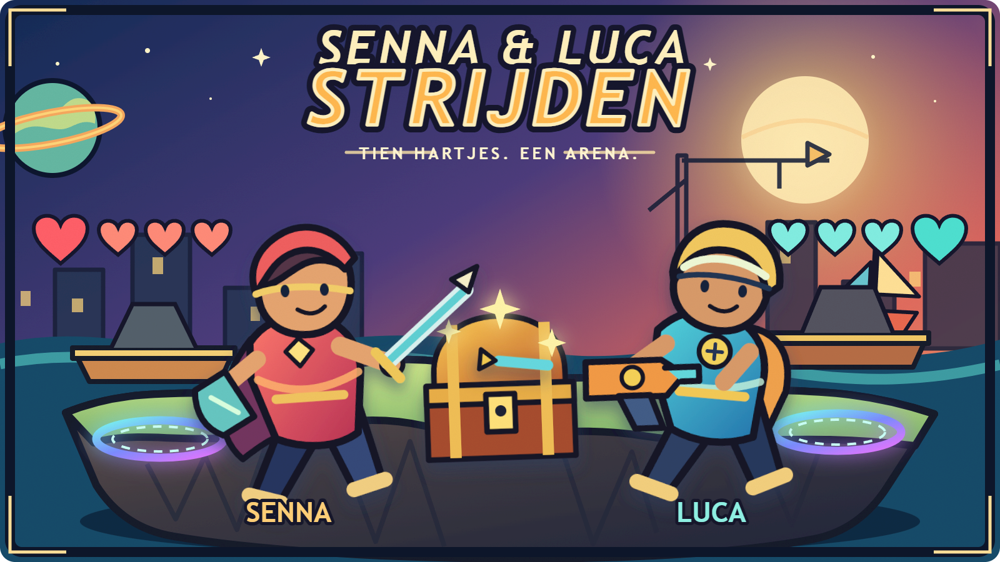

# Product Requirements Document: Senna & Luca Strijders

**Status:** Concept voor akkoord 
**Datum:** 18 augustus 2026 
**Producteigenaar:** Ruud / neworange-ruud 
**Bron:** [`gecorrigeerd-transcript.md`](./gecorrigeerd-transcript.md) en de bestaande Browser Multiplayer Foundation

## 1. Samenvatting

Senna & Luca Strijders is een besloten browsergame waarin Luca en Senna ieder op een eigen apparaat in realtime tegen elkaar spelen. Ze kiezen een personage en uiterlijk, betreden samen een platform-arena, zoeken kisten met wapens en verrassingen en proberen de tien hartjes van de tegenstander weg te spelen. De game is volledig Nederlandstalig, eenvoudig te bedienen voor kinderen van zes en zeven jaar en geoptimaliseerd voor touchbediening op iPads.

De bestaande Browser Multiplayer Foundation vormt het startpunt. Deze bewijst dat twee browsers via een Vercel API en Upstash Redis gedeelde state kunnen lezen en veilig gelijktijdige wijzigingen kunnen verwerken. De huidige demonstratiegame, Engelse interface en spelstate worden vervangen. De generieke stateprotocollen kunnen waar passend worden hergebruikt.

## 2. Productdoel

Een veilige, begrijpelijke en speelse online arena maken waarin uitsluitend Luca en Senna samen een korte wedstrijd kunnen spelen, zonder installatie en zonder dat een volwassene tijdens het spelen technische handelingen hoeft uit te voeren.

### Succescriteria

- Luca en Senna kunnen zelfstandig binnen twee minuten een wedstrijd starten.
- Beide spelers zien bewegingen en acties van de ander snel genoeg om aanvallen bewust uit te voeren, te blokkeren en te ontwijken.
- Een volledige wedstrijd kan op twee iPads worden uitgespeeld zonder vastlopende of uiteenlopende spelstate.
- Een derde persoon kan niet als Luca of Senna deelnemen of een bezette speler overnemen.
- Alle zichtbare spelteksten en foutmeldingen zijn in begrijpelijk Nederlands.
- Pauzeren stopt het spel voor beide spelers en geeft geen van beiden voordeel.
- De game werkt na deployment via de productie-URL op Vercel.

## 3. Doelgroep en context

### Primaire spelers

- **Luca:** kind van circa zes of zeven jaar, speelt op een eigen iPad.
- **Senna:** kind van circa zes of zeven jaar, speelt op een eigen iPad.

### Gebruikscontext

- Twee spelers gebruiken gelijktijdig ieder een eigen browser en scherm.
- De primaire apparaten zijn iPads in liggende stand.
- De spelers kunnen op verschillende locaties of netwerken zitten; de game mag niet afhankelijk zijn van hetzelfde lokale netwerk.
- Een volwassene kan helpen bij de eerste koppeling of het herstellen van een sessie, maar niet bij normale spelhandelingen.

### UX-principes

- Grote touchdoelen en weinig tekst.
- Herkenbare pictogrammen naast tekstlabels.
- Geen vrije tekstinvoer nodig om een standaardwedstrijd te starten.
- Directe visuele feedback op aanraken, schade, blokkeren, kisten en verbindingsstatus.
- Geen verborgen essentiële bediening of complexe menuhiërarchie.
- Geen reclame, tracking of openbare spelerslijst.

## 4. Kernconcept

### Wedstrijdlus

1. De speler opent de game en krijgt toegang tot diens eigen, vaste spelersplek: Luca of Senna.
2. De speler kiest een beschikbaar uiterlijk voor het personage.
3. Beide spelers kiezen of bevestigen de wereld voor de volgende wedstrijd.
4. Zodra beide spelers klaar zijn, start de wedstrijd met beide personages tegenover elkaar en met tien hartjes.
5. Spelers bewegen door de arena, gebruiken platforms en dekking en zoeken periodiek verschijnende kisten.
6. Een speler opent een kist met de actieknop en ontvangt een wapen, verbetering of tijdelijk nadeel.
7. Spelers vallen aan, verdedigen en ontwijken. Geldige treffers kosten hartjes.
8. Zodra een speler nul hartjes heeft, eindigt de wedstrijd en wordt de winnaar duidelijk getoond.
9. Beide spelers kunnen een rematch starten en opnieuw een wereld en uiterlijk kiezen.

### Productvorm

De beoogde vorm is een realtime 2D platform-arena met een zijaanzicht. Iedere speler heeft een eigen camerabeeld dat het eigen personage volgt, zodat rennen, verstoppen achter objecten en het zoeken van de tegenstander betekenis hebben. Dit is de werkhypothese voor het implementatieplan; de definitieve camera en arena-afmetingen moeten in een vroege gameplayprototype worden gevalideerd.

## 5. Functionele requirements

Prioriteiten gebruiken **P0** voor noodzakelijk in versie 1, **P1** voor gewenst na een werkende kern en **P2** voor mogelijke latere uitbreiding.

### 5.1 Toegang en spelers

- **P0:** Alleen de twee rollen Luca en Senna kunnen deelnemen.
- **P0:** Een apparaat of sessie mag alleen acties uitvoeren voor de toegewezen speler.
- **P0:** Een derde bezoeker kan geen speler claimen, een actieve speler overnemen of spelacties namens die speler verzenden.
- **P0:** Een terugkerend vertrouwd apparaat kan de juiste spelersrol hervatten zonder iedere keer een naam in te voeren.
- **P0:** Het moet mogelijk zijn om een verloren of vervangen apparaat via een handeling voor een volwassene opnieuw te koppelen.
- **P0:** De interface toont begrijpelijk of de andere speler online, offline, klaar of gepauzeerd is.

De concrete toegangsmethode, bijvoorbeeld apparaatsleutels met een beheerpincode of persoonlijke uitnodigingslinks, wordt in het implementatieplan gekozen. Een alleen in de browser opgeslagen spelerskeuze voldoet niet aan deze requirements.

### 5.2 Lobby en wedstrijdstart

- **P0:** De speler ziet diens eigen naam en personage duidelijk.
- **P0:** Beide spelers kunnen een uiterlijk kiezen en aangeven dat ze klaar zijn.
- **P0:** De wedstrijd start pas wanneer beide spelers toegang hebben en klaar zijn.
- **P0:** De gekozen wereld is voor beide spelers gelijk en wordt voor de start getoond.
- **P0:** Een speler krijgt duidelijke Nederlandstalige feedback zolang op de ander wordt gewacht.
- **P1:** Als spelers verschillende werelden kiezen, beslist een eenvoudige, vooraf zichtbare regel, bijvoorbeeld om de beurt kiezen of willekeurig kiezen uit beide voorkeuren.

### 5.3 Personages en uiterlijk

- **P0:** Er zijn afzonderlijk herkenbare basiskarakters voor Luca en Senna.
- **P0:** Een speler kan voor de wedstrijd een uiterlijk kiezen.
- **P0:** Minimaal de oorspronkelijke thema's superheld, soldaat, ridder, astronaut en piraat zijn voorzien.
- **P1:** Extra originele uiterlijken kunnen later worden toegevoegd zonder de spelbalans te veranderen.
- **P0:** Een uiterlijk is cosmetisch en geeft geen spelvoordeel.

Mario en Luigi zijn in het gesprek genoemd, maar zijn personages van een externe rechthebbende. Voor een online deployment worden deze niet letterlijk overgenomen zonder toestemming. Een eventuele vervanging moet een eigen naam en duidelijk origineel ontwerp krijgen.

### 5.4 Besturing en beweging

- **P0:** De speler kan naar links en rechts bewegen.
- **P0:** De speler kan springen, ook op platforms en over de tegenstander heen.
- **P0:** De speler kan een aanval uitvoeren.
- **P0:** De speler kan verdedigen of blokkeren.
- **P0:** De speler kan een aanval ontwijken door te bewegen of te springen.
- **P0:** De touchbediening blijft tijdens het spelen op vaste, goed bereikbare posities staan.
- **P0:** De besturing ondersteunt gelijktijdige invoer, zoals bewegen en aanvallen.
- **P0:** Een actie heeft direct lokale feedback, ook als bevestiging van de andere speler nog onderweg is.
- **P1:** Toetsenbordbediening ondersteunt ontwikkeling en spelen op desktop, maar is niet de primaire ervaring.

### 5.5 Arena's en werelden

- **P0:** De game ondersteunt arena's met een speelvloer, platforms, grenzen, spawnpunten en kistlocaties.
- **P0:** Obstakels en gebouwen kunnen zicht of aanvallen blokkeren en als dekking dienen.
- **P0:** Als een speler buiten het geldige speelveld raakt, verschijnt die veilig terug op een vooraf bepaald punt zonder verlies van een hartje.
- **P0:** Een respawn mag niet direct tot een onvermijdelijke treffer leiden; een korte bescherming is toegestaan.
- **P1:** De volledige set voorziene thema's is: strand, bos, ruimteplaneet, bouwplaats, stad en boot.
- **P0:** Versie 1 bevat minimaal een volledige arena; de andere thema's gebruiken hetzelfde spelsysteem en kunnen tijdens de realisatie gefaseerd worden toegevoegd.
- **P1:** Arena's kunnen gekoppelde teleporteerplekken bevatten. Een speler op zo'n plek kiest eenvoudig een bestemming en wordt daarheen verplaatst.

Het exacte aantal arena's bij de eerste publieke productieversie is nog een scopebesluit. De technische en contentstructuur moet alle zes thema's ondersteunen zonder zes afzonderlijke spelimplementaties.

### 5.6 Kisten en verrassingen

- **P0:** Spelers starten iedere wedstrijd zonder wapen.
- **P0:** Kisten verschijnen gedurende de wedstrijd op geldige, bereikbare locaties.
- **P0:** Een verschijnende kist wordt vooraf of tijdens de landing duidelijk aangekondigd.
- **P0:** Alleen een speler binnen bereik kan een kist met de actieknop openen.
- **P0:** Als beide spelers dezelfde kist proberen te openen, bepaalt de gedeelde spelstate eenduidig wie de inhoud krijgt.
- **P0:** De inhoud wordt duidelijk geanimeerd en benoemd met een pictogram en eenvoudig Nederlands label.
- **P0:** De basisinhoud bestaat uit een zwaard, Nerf-gun, pantser, camouflage, snelheid en een kleiner of zwakker zwaard.
- **P0:** Een tijdelijk effect toont zichtbaar wat het doet en hoelang het nog duurt.
- **P0:** Een vervangend wapen blijft actief totdat het wordt gebruikt, weggegooid of vervangen volgens de definitieve inventarisregels.
- **P1:** De verdeling van kisten voorkomt dat een wedstrijd hoofdzakelijk door pech wordt beslist, bijvoorbeeld door begrensde willekeur en een herstelkans voor de speler die achterstaat.

### 5.7 Wapens, inventaris en gevecht

- **P0:** De game bevat geen realistisch vuurwapengeweld.
- **P0:** Het zwaard ondersteunt een aanval van dichtbij.
- **P0:** Een zwaard kan worden gegooid en moet daarna worden teruggehaald of via een duidelijke regel terugkeren.
- **P0:** De Nerf-gun vuurt herkenbare speelgoedprojectielen af en heeft een beperkte vuursnelheid of munitie.
- **P0:** Een speler kan meer dan één type wapen bezitten en met één duidelijke bediening tussen beschikbare wapens wisselen.
- **P0:** Aanvallen hebben voorspelbare reikwijdte, snelheid en schade.
- **P0:** Blokkeren voorkomt of vermindert schade volgens een voor kinderen zichtbare regel.
- **P0:** De server of gedeelde spelsimulatie beslist uiteindelijk of een treffer, kistclaim en schade geldig is; een browser mag niet zelfstandig definitieve schade aan de tegenstander toekennen.
- **P0:** Trefferfeedback is niet bloederig en past bij speelgoed- en tekenfilmactie.
- **P1:** Pantser, camouflage en snelheid hebben per effect een begrensde duur of capaciteit en zijn zichtbaar voor beide spelers.

De exacte schade, afkoeltijden, inventarisgrootte en effectduur worden tijdens balanstesten vastgesteld en als configureerbare spelwaarden beheerd.

### 5.8 Hartjes, einde en rematch

- **P0:** Iedere speler begint met tien zichtbare hartjes.
- **P0:** Geldige schade verwijdert een of meer hartjes volgens het gebruikte wapen en actieve bescherming.
- **P0:** Er is geen puntentelling.
- **P0:** Bij nul hartjes stopt de wedstrijd onmiddellijk voor beide spelers.
- **P0:** Het eindscherm toont in eenvoudig Nederlands wie heeft gewonnen en biedt een rematch.
- **P0:** Een rematch wist alle tijdelijke wapens, effecten, projectielen en kisten en herstelt beide spelers naar tien hartjes.

### 5.9 Pauze en herstel

- **P0:** Beide spelers kunnen een globale pauze aanvragen of activeren.
- **P0:** Tijdens de pauze stoppen beweging, aanvallen, projectielen, kisten en effecttimers voor beide spelers.
- **P0:** Het scherm toont wie heeft gepauzeerd en dat de ander niet verder kan spelen.
- **P0:** Hervatten gebeurt met een korte aftelling, zodat geen speler wordt verrast.
- **P0:** Bij tijdelijk verbindingsverlies wordt de wedstrijd veilig bevroren of krijgt de verbonden speler geen mogelijkheid om de ander te beschadigen.
- **P0:** Na kort verbindingsverlies kan de speler terugkeren in dezelfde wedstrijd.
- **P0:** Bij onherstelbare desynchronisatie wordt niet stilzwijgend doorgespeeld; beide spelers zien een herstelmelding en kunnen de wedstrijd veilig herstarten.

### 5.10 Taal, uitleg en audio

- **P0:** Alle interface-, status-, instructie- en foutteksten zijn Nederlands.
- **P0:** Een eerste speelronde introduceert de belangrijkste knoppen met korte visuele aanwijzingen.
- **P0:** Belangrijke informatie wordt niet uitsluitend met kleur overgebracht.
- **P0:** Animaties respecteren waar praktisch de browserinstelling voor minder beweging.
- **P1:** Geluidseffecten ondersteunen acties zoals springen, blokkeren, geraakt worden en een kist openen.
- **P1:** Muziek en geluid kunnen afzonderlijk worden gedempt.

## 6. Visuele richting

De gewenste stijl is een combinatie van tekenfilmachtig en enigszins realistisch: duidelijke silhouetten en expressieve animaties, met meer detail en materiaalgevoel dan een vlakke cartoon. Geweld blijft speels en niet realistisch. De werelden mogen kleurrijk en fantasierijk zijn, maar personages, platforms, kisten en projectielen moeten in één oogopslag van de achtergrond te onderscheiden zijn.

De eerste vastgelegde stijlreferentie is de titelillustratie [`senna-luca-strijden-intro.png`](./senna-luca-strijden-intro.png), met [`senna-luca-strijden-intro.svg`](./senna-luca-strijden-intro.svg) als bewerkbare bron. Deze bepaalt voorlopig de combinatie van dikke inktlijnen, geschilderde lichtvlakken, heldere kleuren en speelse actie. Omdat nog geen uiterlijkreferenties van Senna en Luca zijn aangeleverd, zijn de personages conceptfiguren en geen portretten. De illustratie blijft concept art totdat de visuele richting is goedgekeurd.

## 7. Niet-functionele requirements

### Prestaties en synchronisatie

- De game streeft op ondersteunde iPads naar vloeiende lokale rendering van 60 frames per seconde en accepteert 30 frames per seconde als ondergrens op oudere ondersteunde apparaten.
- Lokale bediening geeft idealiter binnen 100 ms zichtbare feedback.
- Onder normale netwerkcondities hoort de andere speler een actie binnen circa 200 ms waar te nemen.
- De simulatie moet korte netwerkvertraging en berichten in een andere volgorde kunnen opvangen zonder blijvende uiteenlopende state.
- Herverbinden mag niet leiden tot dubbele spelers, dubbele kistbeloningen of opnieuw toegepaste schade.

### Apparaten en browsers

- Primaire ondersteuning: de actuele publieke versie van Safari op de beschikbare iPads.
- Secundaire ondersteuning: actuele Chrome, Edge en Safari op desktop voor beheer, ontwikkeling en testen.
- De spelweergave is geoptimaliseerd voor liggende stand en blijft bruikbaar op kleinere schermen.
- Safe areas, browserbalken en touchgebaren mogen essentiële bediening niet bedekken of onbedoeld activeren.

### Beveiliging en privacy

- Toegang tot een spelersrol wordt aan de serverzijde gecontroleerd.
- Alle spelacties worden gevalideerd op identiteit, wedstrijdstatus en geldige spelregels.
- Geheime sleutels staan niet in browsercode of Git.
- Er wordt geen gevoelige persoonlijke informatie opgeslagen.
- Telemetrie is standaard afwezig. Als later foutregistratie wordt toegevoegd, bevat die geen chat, vrije tekst of onnodige persoonsgegevens.
- Het systeem is voor twee vaste spelers ontworpen en hoeft geen openbare accounts, matchmaking of chat te ondersteunen.

### Betrouwbaarheid

- Productie-, preview- en ontwikkeldata blijven van elkaar gescheiden.
- Een nieuwe deployment mag een actieve productiewedstrijd niet door incompatibele state onbruikbaar maken zonder gecontroleerde migratie of reset.
- De game toont een bruikbare Nederlandstalige melding als de backend tijdelijk niet bereikbaar is.

## 8. Technische uitgangspositie en randvoorwaarden

### Bestaande foundation

De huidige codebase bestaat uit:

- Vite en TypeScript voor de browserapp.
- Een statische Vercel-frontend en Vercel Function op `/api/state`.
- Upstash Redis als centrale opslag van één JSON-stateobject per omgeving.
- Polling iedere 500 ms wanneer het tabblad zichtbaar is.
- Optimistische, versiebeveiligde JSON Merge Patch-updates met conflict retry.
- Tests voor het protocol, de API en de Redis state store.

### Herbruikbaar

- Projectopzet voor Vite, TypeScript, Vercel en tests.
- Omgevingsscheiding en Upstash-integratie.
- Versiebeveiligde updates voor langzaam veranderende state zoals lobby, ready-status, wereldkeuze, pauze en rematch.
- Het generieke JSON-protocol, voor zover dit naast een realtime spelkanaal nog nodig is.

### Niet voldoende voor het eindproduct

- Polling per 500 ms is niet snel genoeg voor realtime beweging, projectielen, blokkeren en treffers.
- De huidige API heeft geen authenticatie, spelersbezit of validatie van spelspecifieke acties.
- De client kan nu willekeurige gedeelde state wijzigen; dat voldoet niet aan de eis dat een speler alleen het eigen personage bestuurt.
- De huidige state store bewaart één door clients samengesteld object en bevat geen autoritatieve spelklok of simulatie.
- De Tap Relay-interface en Engelstalige inhoud zijn alleen demonstratiemateriaal.

Het implementatieplan moet daarom een Vercel-compatibele realtime architectuur kiezen en expliciet bepalen waar de autoritatieve spelsimulatie draait. De foundation hoeft niet volledig te worden behouden als een kleinere vervanging aantoonbaar beter aan de gameplay- en beveiligingseisen voldoet.

## 9. Hosting en oplevering

- De broncode wordt ondergebracht in `https://github.com/neworange-ruud/senna-luca-stijders`.
- De lokale mapnaam en productnaam gebruiken momenteel `strijders`, terwijl de opgegeven repository-URL `stijders` gebruikt. De repository-URL geldt als aangeleverde bestemming totdat dit voor deployment expliciet wordt bevestigd.
- Er wordt een nieuw Vercel-project aangemaakt onder het account `neworange-ruud`.
- Productie draait op Vercel in een Europese regio waar de gebruikte diensten dat ondersteunen.
- Secrets en servicekoppelingen worden via Vercel-omgevingsvariabelen of integraties beheerd.
- Previewdeployments mogen geen productiepotje of productiegegevens beïnvloeden.
- Repository- en Vercel-projectaanmaak vallen buiten deze PRD-stap en worden pas tijdens uitvoering van het implementatieplan gedaan.

## 10. Buiten scope van versie 1

- Meer dan twee spelers, matchmaking of openbare kamers.
- Chat of communicatie met onbekende spelers.
- Echte vuurwapens of realistisch geweld.
- Grijphaken.
- Zwemmen, verdrinken of verlies van hartjes door buiten het speelveld vallen.
- Kleiner worden als personage.
- Oproepbare wezens die zelfstandig voor een speler vechten.
- Vanuit een vliegtuig aan een wedstrijd beginnen.
- Punten, klassementen of wereldwijde ranglijsten.
- Voertuigen zoals tanks en auto's.
- Accounts, profielen, aankopen, advertenties of betaalde cosmetica.
- Letterlijke reproducties van auteursrechtelijk beschermde externe gamepersonages zonder toestemming.

## 11. Acceptatiecriteria voor versie 1

Versie 1 is productmatig gereed wanneer:

1. Twee geautoriseerde apparaten als Luca en Senna dezelfde wedstrijd kunnen openen.
2. Geen ongeautoriseerd apparaat een spelersrol kan claimen of geldige spelacties kan uitvoeren.
3. Beide spelers een uiterlijk en beschikbare wereld kunnen kiezen en klaar kunnen staan.
4. Een wedstrijd start met tien hartjes per speler en zonder wapens.
5. Beide spelers vloeiend kunnen lopen, springen, aanvallen, blokkeren en ontwijken.
6. Kisten betrouwbaar verschijnen, door precies één speler worden geclaimd en bruikbare effecten of wapens geven.
7. Het zwaard, werpen van het zwaard, de Nerf-gun en wisselen tussen wapens werken voor beide spelers.
8. Geldige treffers bij beide spelers tot dezelfde hartjesstand leiden.
9. Buiten het veld raken tot een veilige terugplaatsing zonder schade leidt.
10. Pauze, hervatten met aftelling en tijdelijk verbindingsverlies geen oneerlijk voordeel geven.
11. Nul hartjes de wedstrijd voor beide spelers beeindigt en een schone rematch mogelijk maakt.
12. De volledige spelerservaring Nederlandstalig en zelfstandig begrijpelijk is voor de doelgroep.
13. De game op de twee beoogde iPads via de Vercel-productie-URL speelbaar is.
14. Geautomatiseerde tests de kritieke spelregels, toegangscontrole en state-overgangen afdekken.

## 12. Open beslissingen voor het implementatieplan

De volgende punten moeten voor of tijdens het implementatieplan worden beslist; ze veranderen het productdoel niet:

1. Welke iPad-modellen en iPadOS-versies minimaal worden ondersteund.
2. Of spelers altijd op afstand kunnen spelen of voornamelijk op hetzelfde netwerk; de huidige eis neemt spelen via internet als uitgangspunt.
3. Welke Vercel-compatibele realtime dienst en autoritatieve simulatie worden gebruikt.
4. Hoe de twee apparaten veilig voor Luca en Senna worden gekoppeld en hoe een volwassene toegang herstelt.
5. Hoe de wereldkeuze wordt beslist als Luca en Senna iets anders kiezen.
6. Hoeveel van de zes wereldthema's bij de eerste productieoplevering volledig beschikbaar moeten zijn.
7. De exacte camera, grootte van een arena en mate waarin spelers elkaar uit het oog kunnen verliezen.
8. De definitieve inventarislimiet, schade, timing, kistkansen en duur van effecten.
9. Of teleporteerplekken noodzakelijk zijn voor de eerste arena of als eerste contentuitbreiding volgen.
10. Goedkeuring en eventuele aanscherping van de visuele richting uit de titelillustratie.
11. Of geluid en muziek onderdeel van de eerste productieoplevering zijn.
12. Bevestiging van de repositoryspelling: `senna-luca-stijders` of `senna-luca-strijders`.
