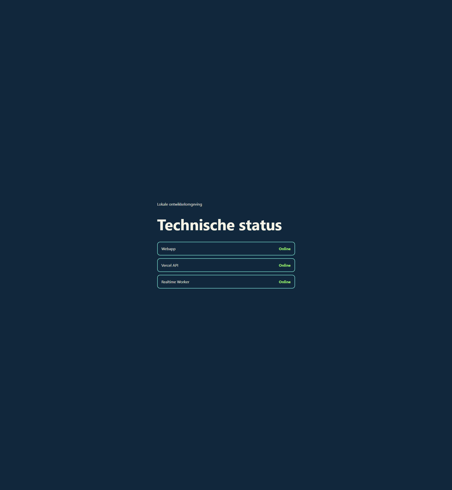

# Phase 0 Checkpoint: Baseline And Toolchain

Date: 2026-08-19

## Result

The original polling foundation remains covered while the repository now has separate browser, Vercel-compatible API, and Cloudflare Worker type/runtime boundaries. The unattended local loop launches Vite with the API development adapter and Wrangler with a local Durable Object. `npm run dev:vercel` remains available for explicit provider-parity checks after selecting the authenticated Vercel team.

## Versions

- Node.js: 24.13.1 locally; CI floor is Node.js 22
- npm: 11.10.0
- Vite: 8.2.1
- Wrangler: 4.124.0
- Playwright: 1.62.1
- TypeScript: 5.9

## Architecture

```text
Browser (Vite/Vercel)
  |-- /api/* -> typed Vercel handlers / local development adapter
  `-- /ws    -> Cloudflare Worker
                    `-- Durable Object: development:main

Future secure APIs -> Upstash Redis (device bindings and admin state only)
```

Development, preview, and production use distinct Worker names and Durable Object namespaces in `wrangler.toml`. Local object data is kept under ignored `.wrangler/` storage.

## Verification

- Baseline before changes: `npm run check` passed 3 files / 7 tests, strict TypeScript, and Vite production build.
- `npm run check`: passed formatting, typed ESLint, 2 unit tests, 5 integration tests, browser/server/Worker type checks, and production build.
- `npm run test:unit:coverage`: passed and produced `coverage/unit/`; `src/game` is intentionally empty until Phase 1.
- `npm run test:e2e`: 2 Chromium tests passed, including two WebSockets sharing one local Durable Object.
- `npm run test:e2e:webkit`: the same 2 tests passed in WebKit.
- `npm run dev` health probe: web API and Worker both returned status `ok` for the development environment.
- Tracked-secret check: `git ls-files ".env*" "*.local" "opencode.json"` returned no files. `.env.example` contains placeholders only and real environment files remain ignored.

## Baseline Issues Removed

- One combined Vitest command is now split into unit and integration layers.
- Formatting, typed linting, coverage, Worker checking, and browser smoke tests are enforced by scripts and CI.
- The package and local documentation now identify Senna & Luca Strijders rather than the generic foundation.
- WebSocket and Durable Object local development no longer depends on production credentials.
- Vercel CLI team selection no longer blocks the default unattended development command.

## Visual Evidence

The local status page shows the webapp, Vercel-compatible API, and realtime Worker online:


