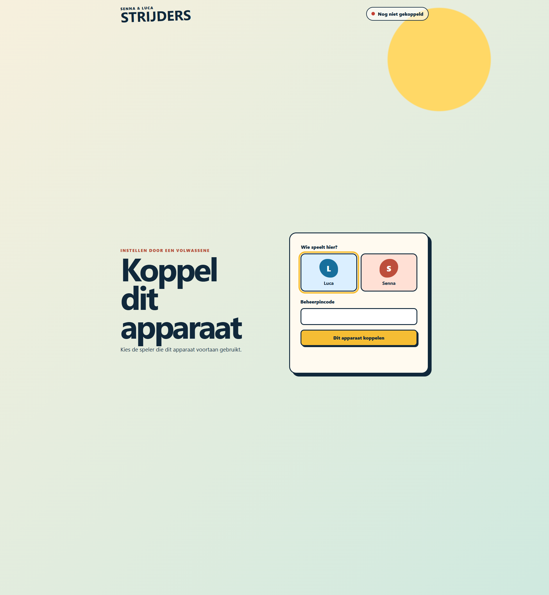

# Phase 3 Checkpoint: Secure Device Pairing

Date: 2026-08-19

## Result

The generic `/api/state` endpoint, polling client, Redis state store, and English Tap Relay UI are removed. Vercel now exposes only health, pairing, and session Functions. Devices receive opaque HttpOnly credentials; only salted hashes and monotonic role generations are stored in environment-prefixed Upstash keys.

## Security Flow

1. An unpaired device sees the Dutch adult setup screen and selects Luca or Senna.
2. `POST /api/pair` validates method, same origin, JSON content, body shape, fixed-window rate limit, and the adult PIN through constant-time digest comparison.
3. Occupied roles return `ROLE_OCCUPIED`; replacement requires a second explicit action.
4. Replacement atomically increments the Redis generation and sends a timestamped HMAC-signed revocation to the Worker.
5. The Durable Object persists the minimum generation and closes any older socket before the replacement cookie is issued.
6. `GET /api/session` matches the opaque cookie against both salted role hashes and issues a two-minute HMAC role token.
7. Preview and production Workers accept identity only from the token WebSocket subprotocol. Stale generations remain rejected after Durable Object eviction.

Logs contain request ID, operation, stable code, and optional role only. Tests assert that PIN values do not appear. Credentials, cookies, tokens, request bodies, and free text are never logged.

## Verification

- `npm run check`: passed with 36 unit tests, 8 Node integration tests, 6 Workers-runtime tests, typed lint, all type checks, and production build.
- `npm run test:e2e`: 4 Chromium journeys passed.
- `npm run test:e2e:webkit`: the same 4 journeys passed in WebKit.
- The three-context journey proves a wrong-PIN attacker cannot pair, explicit replacement reaches generation 2, the old socket is closed, and its stale token cannot reconnect.
- Worker tests prove signed revocation generation persistence and stale-generation rejection.
- Pairing API tests prove fail-closed behavior: no replacement cookie is issued when live revocation fails.
- Vercel preview `dpl_Ex7kb8sqhGL6d8yqa9KT24JB6Jmz` is Ready with only `api/health`, `api/pair`, and `api/session` in `fra1`.
- Cloudflare Worker version `10dec14b-cc3a-4c2c-afb8-1238d4cc360b` is healthy with server-only signing and revocation secrets.

## Visual Evidence

The preview environment still uses a generated temporary `ADMIN_PIN`. Replace it in Vercel before pairing physical devices.
