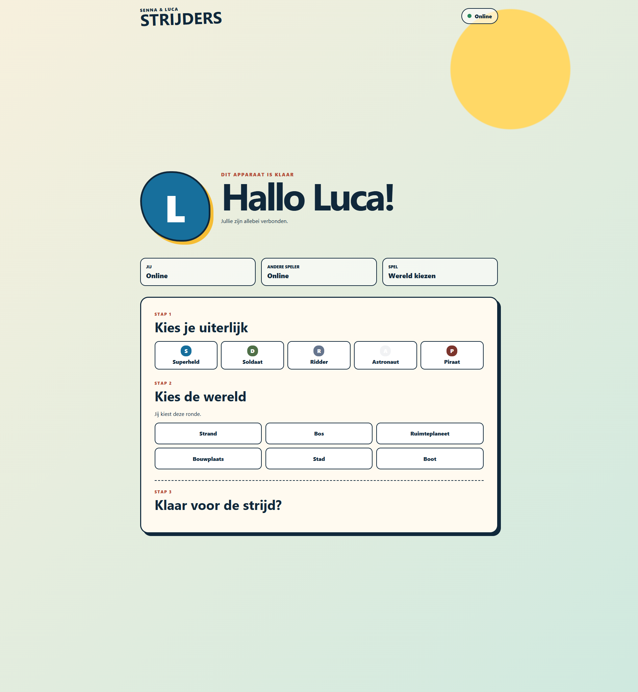

# Phase 4 Checkpoint: Lobby, Cosmetics, And Match Start

Date: 2026-08-19

## Result

Authenticated Luca and Senna devices now enter one synchronized Dutch lobby. Returning devices resume through their HttpOnly credential, both roles see live peer state, and all choices are authoritative Worker commands rather than browser state mutations.

## Content

- Distinct labeled Luca and Senna geometric identity shapes
- Five cosmetic-only definitions: Superheld, Soldaat, Ridder, Astronaut, and Piraat
- Six Dutch world definitions: Strand, Bos, Ruimteplaneet, Bouwplaats, Stad, and Boot
- Every world currently reuses the validated beach geometry; distinct layouts remain Phase 9 content
- Content validation rejects duplicate definitions and any cosmetic gameplay fields

## Match Start

- Luca chooses the first world; chooser alternates by completed match.
- The other role sees the same selected world and explicitly confirms it.
- Both roles independently select a cosmetic and ready state.
- Countdown begins only with both authenticated/connected roles, a confirmed world, and both cosmetics/readiness.
- Refresh restores identity and authoritative lobby state without duplicating a player.
- Disconnect clears readiness and the Worker preserves safe lifecycle behavior.

## Verification

- Focused content tests and full unit suite passed.
- `npm run check` passed with 38 unit tests, 8 Node integration tests, 6 Workers-runtime tests, typed lint, runtime type checks, and production build.
- Chromium and WebKit pairing/security, realtime, and smoke suites pass.
- The dual-client lobby journey uses separate Luca/Senna contexts at 1180×820 with touch enabled, reloads Luca as a returning device, selects one shared world and two cosmetics, and observes the same countdown and playing transition.
- Vercel preview deployment `dpl_yybbE1FYtKbfhdxuhgj5PKiCvoGc` is Ready with the synchronized lobby bundle.

## Visual Evidence

